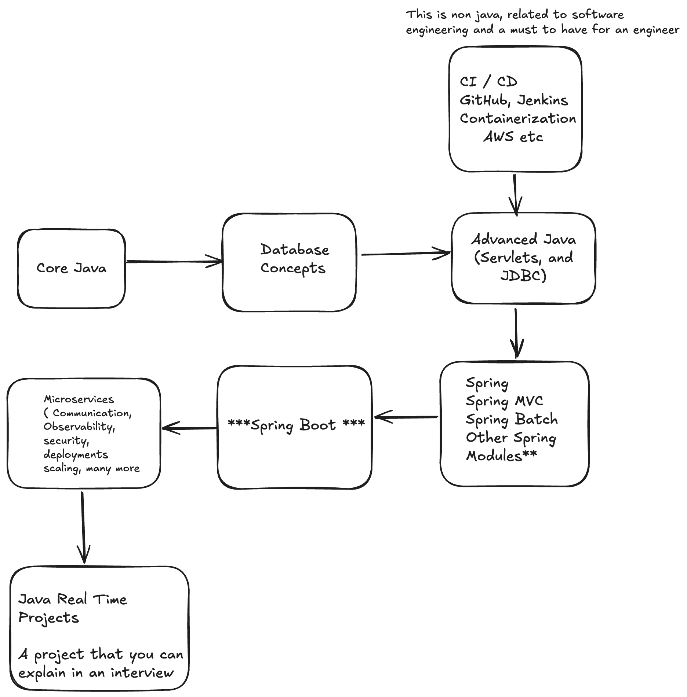

# Java Backend Road Map for absolute beginners

---
---

## Core Java

[Complete Core Java In Simple Way by Nagoor Babu from DurgaSoft](https://www.udemy.com/course/complete-core-java-in-simple-way/?couponCode=KEEPLEARNING)

## Database 

[Postgres SQL](https://youtu.be/qw--VYLpxG4?si=aTUSl-M5G1OlMAVR)
This video is focussed on postgres, you can chosse any db of your choice. The concept will be same just the syntax and a few other differences.

## Advanced Java

[Advanced Java (JDBC,Servlets & JSP) Videos and Materials](https://www.durgasoftonline.com/courses/JDBC-Java-Database-Connectivity-5e74ab810cf2eb16f8ea483f)

** You can skip JSP videos here

## Spring

[Spring Framework](https://youtube.com/playlist?list=PLsyeobzWxl7qbKoSgR5ub6jolI8-ocxCF&si=y8XKhk0KADzOkx6i)

### Its very crucial for you to explore and find the best content for you.

Coming soon .. More links and resources.